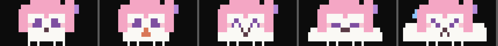

# doro-context

A Claude Code mod: a pixel doro, drawn in Clawd's quadrant-block style, lives in a band above your prompt and eats your context window. The fuller the window, the rounder she gets.



| Context used | Doro |
| --- | --- |
| under 10% | hungry, waiting for tokens |
| 10–35% | snacking on a tangerine |
| 35–60% | munching happily `^ω^` |
| 60–80% | getting stuffed |
| 80% and up | about to pop: time to `/compact` |

She walks back and forth (slower as she fills up), breathes while she rests, and stops to pant when she's nearly full. Beside her: a usage bar and `used / window` tokens.

## Install

At the prompt of a Claude Code terminal session:

```
/plugin install doro-context --marketplace GelzoneCC/doro-context
```

Answer `y` to add the marketplace, then pick a scope (user scope loads her in every session).

## Notes

- Hide or show the band with `[-]` or ctrl+x ctrl+a.
- Needs a terminal font with the quadrant block characters (`▘▝▖▗▛▜▙▟`), the same ones Clawd is drawn with.
- In the Claude desktop app she is drawn as a still picture.
